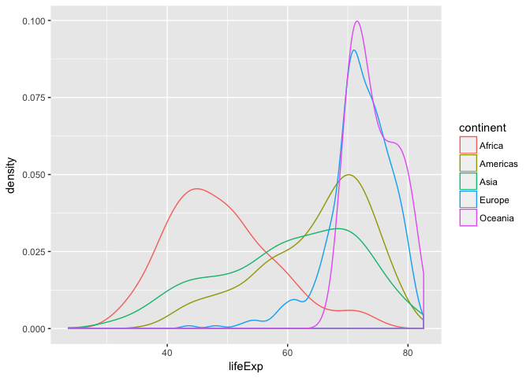

# hw02_gapminder.Rmd
Fariha Khan  
2017-09-24  


#### Work with the gapminder data we explored in class


Load Gapminder and dplyr (via tidyverse)


```r
suppressPackageStartupMessages(library(tidyverse))
suppressPackageStartupMessages(library(gapminder))
```

##### Explore the gapminder object:

1. Is it a data.frame, a matrix, a vector, a list?
- *The gapminder dataset is a list object and a data frame*

```r
str(gapminder)
```

```
## Classes 'tbl_df', 'tbl' and 'data.frame':	1704 obs. of  6 variables:
##  $ country  : Factor w/ 142 levels "Afghanistan",..: 1 1 1 1 1 1 1 1 1 1 ...
##  $ continent: Factor w/ 5 levels "Africa","Americas",..: 3 3 3 3 3 3 3 3 3 3 ...
##  $ year     : int  1952 1957 1962 1967 1972 1977 1982 1987 1992 1997 ...
##  $ lifeExp  : num  28.8 30.3 32 34 36.1 ...
##  $ pop      : int  8425333 9240934 10267083 11537966 13079460 14880372 12881816 13867957 16317921 22227415 ...
##  $ gdpPercap: num  779 821 853 836 740 ...
```

2. What’s its class?
- *The gapminder dataset is a data frame class (made of lists)*

```r
class(gapminder)
```

```
## [1] "tbl_df"     "tbl"        "data.frame"
```

```r
typeof(gapminder)
```

```
## [1] "list"
```

3. How many variables/columns?
- *There are 6 column*

```r
ncol(gapminder)
```

```
## [1] 6
```

4. How many rows/observations?
- *There are 1704 rows*

```r
nrow(gapminder)
```

```
## [1] 1704
```

5. Can you get these facts about “extent” or “size” in more than one way? Can you imagine different functions being useful in different contexts?
- *The str() function displays a summary of the internal structure of the object*
- *The summary() function shows the name and a summary of each variable*
- *The dim() function gives the value of rows and columns*
- *The length() function gives the number of columns and the names() fucntion outputs the names of of each column*

```r
str(gapminder)
```

```
## Classes 'tbl_df', 'tbl' and 'data.frame':	1704 obs. of  6 variables:
##  $ country  : Factor w/ 142 levels "Afghanistan",..: 1 1 1 1 1 1 1 1 1 1 ...
##  $ continent: Factor w/ 5 levels "Africa","Americas",..: 3 3 3 3 3 3 3 3 3 3 ...
##  $ year     : int  1952 1957 1962 1967 1972 1977 1982 1987 1992 1997 ...
##  $ lifeExp  : num  28.8 30.3 32 34 36.1 ...
##  $ pop      : int  8425333 9240934 10267083 11537966 13079460 14880372 12881816 13867957 16317921 22227415 ...
##  $ gdpPercap: num  779 821 853 836 740 ...
```

```r
summary(gapminder)
```

```
##         country        continent        year         lifeExp     
##  Afghanistan:  12   Africa  :624   Min.   :1952   Min.   :23.60  
##  Albania    :  12   Americas:300   1st Qu.:1966   1st Qu.:48.20  
##  Algeria    :  12   Asia    :396   Median :1980   Median :60.71  
##  Angola     :  12   Europe  :360   Mean   :1980   Mean   :59.47  
##  Argentina  :  12   Oceania : 24   3rd Qu.:1993   3rd Qu.:70.85  
##  Australia  :  12                  Max.   :2007   Max.   :82.60  
##  (Other)    :1632                                                
##       pop              gdpPercap       
##  Min.   :6.001e+04   Min.   :   241.2  
##  1st Qu.:2.794e+06   1st Qu.:  1202.1  
##  Median :7.024e+06   Median :  3531.8  
##  Mean   :2.960e+07   Mean   :  7215.3  
##  3rd Qu.:1.959e+07   3rd Qu.:  9325.5  
##  Max.   :1.319e+09   Max.   :113523.1  
## 
```

```r
dim(gapminder)
```

```
## [1] 1704    6
```

```r
names(gapminder)
```

```
## [1] "country"   "continent" "year"      "lifeExp"   "pop"       "gdpPercap"
```

```r
length(gapminder)
```

```
## [1] 6
```

6. What data type is each variable?
- *The str() function summaries the structure of the object and gives the variable type and range. The variable names and types are:*

       - country  : factor
       - continent: factor
       - year     : integer
       - lifeExp  : numerical
       - pop      : integer
       - gdpPercap: numerical
       

```r
str(gapminder)
```

```
## Classes 'tbl_df', 'tbl' and 'data.frame':	1704 obs. of  6 variables:
##  $ country  : Factor w/ 142 levels "Afghanistan",..: 1 1 1 1 1 1 1 1 1 1 ...
##  $ continent: Factor w/ 5 levels "Africa","Americas",..: 3 3 3 3 3 3 3 3 3 3 ...
##  $ year     : int  1952 1957 1962 1967 1972 1977 1982 1987 1992 1997 ...
##  $ lifeExp  : num  28.8 30.3 32 34 36.1 ...
##  $ pop      : int  8425333 9240934 10267083 11537966 13079460 14880372 12881816 13867957 16317921 22227415 ...
##  $ gdpPercap: num  779 821 853 836 740 ...
```


#### Explore individual variables

##### Pick at least one categorical variable and at least one quantitative variable to explore.
I chose to explore explore the overall population by continent here.

First I used tally() to show the different columns and the number of observations in each conintent.
      

```r
gapminder %>% 
      group_by(continent) %>% 
      tally()
```

```
## # A tibble: 5 x 2
##   continent     n
##      <fctr> <int>
## 1    Africa   624
## 2  Americas   300
## 3      Asia   396
## 4    Europe   360
## 5   Oceania    24
```

I used the summarize() to get the range of the minimum, maximum and average population observed in a given continent.

```r
gapminder %>% 
      group_by(continent) %>% 
      summarise(min_population = min(pop),
                avg_population = mean(pop),
                max_population = max(pop))
```

```
## # A tibble: 5 x 4
##   continent min_population avg_population max_population
##      <fctr>          <dbl>          <dbl>          <dbl>
## 1    Africa          60011        9916003      135031164
## 2  Americas         662850       24504795      301139947
## 3      Asia         120447       77038722     1318683096
## 4    Europe         147962       17169765       82400996
## 5   Oceania        1994794        8874672       20434176
```


continent    min_population   avg_population   max_population
----------  ---------------  ---------------  ---------------
Africa                60011          9916003        135031164
Americas             662850         24504795        301139947
Asia                 120447         77038722       1318683096
Europe               147962         17169765         82400996
Oceania             1994794          8874672         20434176


Here I added a second categorical variable and looked to find which country had the lowest and highest population per given continent. 

```r
gapminder %>% 
      group_by(continent) %>%
      select(continent, country, pop) %>%
      top_n(1, wt = (pop)) %>% 
      arrange(continent)
```

```
## # A tibble: 5 x 3
## # Groups:   continent [5]
##   continent       country        pop
##      <fctr>        <fctr>      <int>
## 1    Africa       Nigeria  135031164
## 2  Americas United States  301139947
## 3      Asia         China 1318683096
## 4    Europe       Germany   82400996
## 5   Oceania     Australia   20434176
```

```r
gapminder %>% 
      group_by(continent) %>%
      select(continent, country, pop) %>%
      top_n(1, wt = desc(pop)) %>% 
      arrange(continent)
```

```
## # A tibble: 5 x 3
## # Groups:   continent [5]
##   continent               country     pop
##      <fctr>                <fctr>   <int>
## 1    Africa Sao Tome and Principe   60011
## 2  Americas   Trinidad and Tobago  662850
## 3      Asia               Bahrain  120447
## 4    Europe               Iceland  147962
## 5   Oceania           New Zealand 1994794
```


#### Plotting gapminder data using ggplot2
1. A scatterplot of two quantitative variables.
Look at the trend between gdpPercap and life expectancy for years after 1990

```r
year_data <- gapminder %>% 
      filter(year >= 1990)

p <- ggplot(year_data, aes(x=gdpPercap, y=lifeExp))
p + geom_point(aes(color=continent),alpha=0.5, size=1)
```

<!-- -->


2. A plot of one quantitative variable

```r
p2 <- ggplot(gapminder, aes(lifeExp))
p2 + geom_density(aes(color=continent))
```

<!-- -->

3. A plot of one quantitative variable and one categorical

```r
year2_data <- gapminder %>% 
      filter(year %in% c(1952, 2007))
p3 <- ggplot(year2_data, aes(x=factor(year), y=lifeExp))
p3 + geom_boxplot(aes(fill=factor(year))) +
      facet_grid(~ continent)
```

<!-- -->

