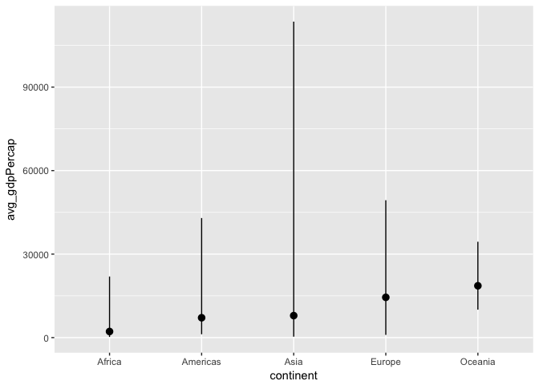

# Homework 3
Fariha Khan  
2017-10-03  


#
#
##### The goal is to manipulate and explore a dataset with the dplyr package, complemented by visualizations made with ggplot2.


Load Gapminder and tidyverse (contains dplyr and ggplot)


```r
suppressPackageStartupMessages(library(tidyverse))
suppressPackageStartupMessages(library(gapminder))
suppressPackageStartupMessages(library(knitr))
```


```r
summary(gapminder)
```

```
##         country        continent        year         lifeExp     
##  Afghanistan:  12   Africa  :624   Min.   :1952   Min.   :23.60  
##  Albania    :  12   Americas:300   1st Qu.:1966   1st Qu.:48.20  
##  Algeria    :  12   Asia    :396   Median :1980   Median :60.71  
##  Angola     :  12   Europe  :360   Mean   :1980   Mean   :59.47  
##  Argentina  :  12   Oceania : 24   3rd Qu.:1993   3rd Qu.:70.85  
##  Australia  :  12                  Max.   :2007   Max.   :82.60  
##  (Other)    :1632                                                
##       pop              gdpPercap       
##  Min.   :6.001e+04   Min.   :   241.2  
##  1st Qu.:2.794e+06   1st Qu.:  1202.1  
##  Median :7.024e+06   Median :  3531.8  
##  Mean   :2.960e+07   Mean   :  7215.3  
##  3rd Qu.:1.959e+07   3rd Qu.:  9325.5  
##  Max.   :1.319e+09   Max.   :113523.1  
## 
```

## Task menu

### 1. Get the maximum and minimum of GDP per capita for all continents


I used the summarize() to get the range of the minimum and maximum GDP per capita observed in a given continent. The data is summarized in a table below.

```r
## Create a subset of values for min, max and average GDP per capita 
minmax_gdpPercap <- gapminder %>% 
      group_by(continent) %>% 
      summarise(min_gdpPercap = min(gdpPercap),
                avg_gdpPercap = mean(gdpPercap),
                max_gdpPercap = max(gdpPercap))
```

#### Visual representation of minimum and maximum GDP per capita by continent


```r
## Display table of min and max values
minmax_gdpPercap %>% 
      select(continent, min_gdpPercap, max_gdpPercap) %>% 
      kable()
```


continent    min_gdpPercap   max_gdpPercap
----------  --------------  --------------
Africa            241.1659        21951.21
Americas         1201.6372        42951.65
Asia              331.0000       113523.13
Europe            973.5332        49357.19
Oceania         10039.5956        34435.37

```r
## Display data in graphical format
ggplot(minmax_gdpPercap, aes(, x=continent, y=avg_gdpPercap)) +
      geom_pointrange(aes(ymin=min_gdpPercap, ymax=max_gdpPercap))
```

<!-- -->


#
### 2. Look at the spread of GDP per capita within the continents.

#
### 3. Compute a trimmed mean of life expectancy for different years.

#
### 4. How is life expectancy changing over time on different continents?


You can also embed plots, for example:

<!-- -->

Note that the `echo = FALSE` parameter was added to the code chunk to prevent printing of the R code that generated the plot.
