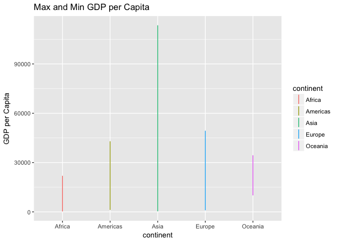
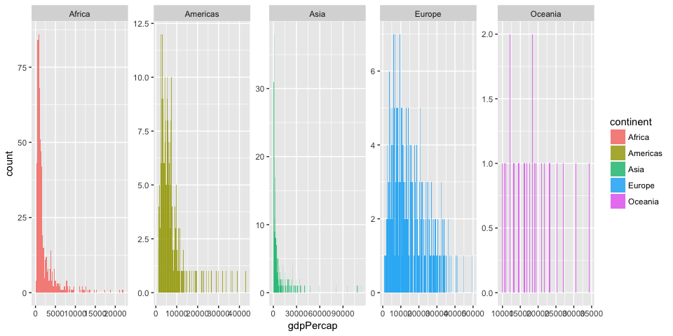

# Homework 3
Fariha Khan  
2017-10-03  


#
#
##### The goal is to manipulate and explore a dataset with the dplyr package, complemented by visualizations made with ggplot2.


Load Gapminder and tidyverse (contains dplyr and ggplot)


```r
suppressPackageStartupMessages(library(tidyverse))
suppressPackageStartupMessages(library(gapminder))
suppressPackageStartupMessages(library(knitr))
```


```r
summary(gapminder)
```

```
##         country        continent        year         lifeExp     
##  Afghanistan:  12   Africa  :624   Min.   :1952   Min.   :23.60  
##  Albania    :  12   Americas:300   1st Qu.:1966   1st Qu.:48.20  
##  Algeria    :  12   Asia    :396   Median :1980   Median :60.71  
##  Angola     :  12   Europe  :360   Mean   :1980   Mean   :59.47  
##  Argentina  :  12   Oceania : 24   3rd Qu.:1993   3rd Qu.:70.85  
##  Australia  :  12                  Max.   :2007   Max.   :82.60  
##  (Other)    :1632                                                
##       pop              gdpPercap       
##  Min.   :6.001e+04   Min.   :   241.2  
##  1st Qu.:2.794e+06   1st Qu.:  1202.1  
##  Median :7.024e+06   Median :  3531.8  
##  Mean   :2.960e+07   Mean   :  7215.3  
##  3rd Qu.:1.959e+07   3rd Qu.:  9325.5  
##  Max.   :1.319e+09   Max.   :113523.1  
## 
```

## Task menu

### 1. Get the maximum and minimum of GDP per capita for all continents


I used the summarize() to get the full range GDP per capita observed in a given continent, and created a subset so I could use it for later questions. 


```r
summary_gdpPercap <- gapminder %>% 
      group_by(continent) %>% 
      summarise(Minimum = min(gdpPercap),
                Q1 = quantile(gdpPercap, probs=0.25),
                Median = median(gdpPercap),
                Q3 = quantile(gdpPercap, probs=0.75),
                Maximum = max(gdpPercap),
                Average = mean(gdpPercap))
```

Here, the minimum and maximum GDP per capita is summarized in a table below by continent.

```r
## Select values for max and min 
## Display values in a table
summary_gdpPercap %>% 
      select(continent, Maximum, Minimum) %>% 
      kable()
```


continent      Maximum      Minimum
----------  ----------  -----------
Africa        21951.21     241.1659
Americas      42951.65    1201.6372
Asia         113523.13     331.0000
Europe        49357.19     973.5332
Oceania       34435.37   10039.5956

```r
## Display values in a table
ggplot(summary_gdpPercap, aes(x=continent, color = continent)) +
       geom_linerange(aes(ymin=Minimum, ymax=Maximum))+
       ggtitle("Max and Min GDP per Capita") +
       ylab("GDP per Capita")
```

<!-- -->

> I've never used geom_linerange before - it seemed to be the best way to graphically show only two values per variable.


#
### 2. Look at the spread of GDP per capita within the continents.

```r
kable(summary_gdpPercap)
```


continent       Minimum          Q1      Median          Q3     Maximum     Average
----------  -----------  ----------  ----------  ----------  ----------  ----------
Africa         241.1659     761.247    1192.138    2377.417    21951.21    2193.755
Americas      1201.6372    3427.779    5465.510    7830.210    42951.65    7136.110
Asia           331.0000    1056.993    2646.787    8549.256   113523.13    7902.150
Europe         973.5332    7213.085   12081.749   20461.386    49357.19   14469.476
Oceania      10039.5956   14141.859   17983.304   22214.117    34435.37   18621.609

```r
ggplot(gapminder, aes(x=gdpPercap, fill = continent)) + 
      geom_histogram(alpha=0.8,binwidth=200) +
      facet_wrap(~ continent, scales ="free", nrow = 1)
```

<!-- -->


#
### 3. Compute a trimmed mean of life expectancy for different years.

#
### 4. How is life expectancy changing over time on different continents?


You can also embed plots, for example:


Note that the `echo = FALSE` parameter was added to the code chunk to prevent printing of the R code that generated the plot.
