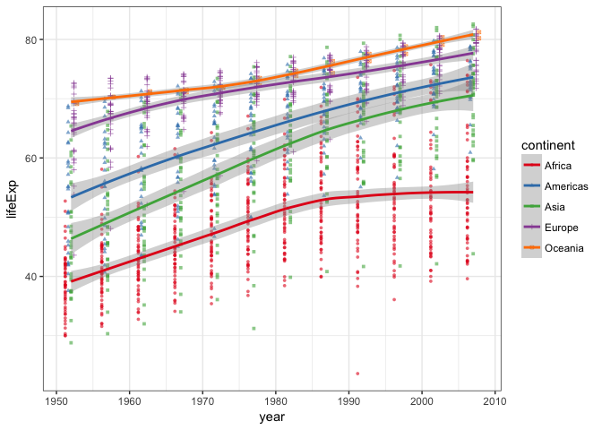
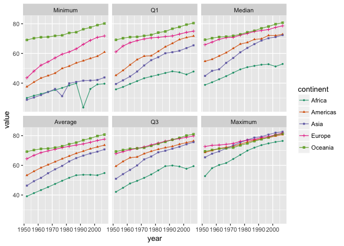

Homework 3
================
Fariha Khan
2017-10-03

##### The goal is to manipulate and explore a dataset with the dplyr package, complemented by visualizations made with ggplot2.

Load Gapminder and tidyverse (contains dplyr and ggplot)

``` r
suppressPackageStartupMessages(library(tidyverse))
suppressPackageStartupMessages(library(gapminder))
suppressPackageStartupMessages(library(knitr))
suppressPackageStartupMessages(library(grid))
suppressPackageStartupMessages(library(gridExtra))
```

``` r
summary(gapminder)
```

    ##         country        continent        year         lifeExp     
    ##  Afghanistan:  12   Africa  :624   Min.   :1952   Min.   :23.60  
    ##  Albania    :  12   Americas:300   1st Qu.:1966   1st Qu.:48.20  
    ##  Algeria    :  12   Asia    :396   Median :1980   Median :60.71  
    ##  Angola     :  12   Europe  :360   Mean   :1980   Mean   :59.47  
    ##  Argentina  :  12   Oceania : 24   3rd Qu.:1993   3rd Qu.:70.85  
    ##  Australia  :  12                  Max.   :2007   Max.   :82.60  
    ##  (Other)    :1632                                                
    ##       pop              gdpPercap       
    ##  Min.   :6.001e+04   Min.   :   241.2  
    ##  1st Qu.:2.794e+06   1st Qu.:  1202.1  
    ##  Median :7.024e+06   Median :  3531.8  
    ##  Mean   :2.960e+07   Mean   :  7215.3  
    ##  3rd Qu.:1.959e+07   3rd Qu.:  9325.5  
    ##  Max.   :1.319e+09   Max.   :113523.1  
    ## 

Task menu
---------

### 1. Get the maximum and minimum of GDP per capita for all continents

I used the summarize() to get the full range GDP per capita observed in a given continent, and created a subset so I could use it for later questions.

``` r
summary_gdpPercap <- gapminder %>% 
      group_by(continent) %>% 
      summarise(Minimum = min(gdpPercap),
                Q1 = quantile(gdpPercap, probs=0.25),
                Median = median(gdpPercap),
                Q3 = quantile(gdpPercap, probs=0.75),
                Maximum = max(gdpPercap),
                Average = mean(gdpPercap))
```

Here, the minimum and maximum GDP per capita is summarized in a table below by continent.

``` r
## Select values for max and min 
## Display values in a table
summary_gdpPercap %>% 
      select(continent, Maximum, Minimum) %>% 
      kable()
```

| continent |    Maximum|     Minimum|
|:----------|----------:|-----------:|
| Africa    |   21951.21|    241.1659|
| Americas  |   42951.65|   1201.6372|
| Asia      |  113523.13|    331.0000|
| Europe    |   49357.19|    973.5332|
| Oceania   |   34435.37|  10039.5956|

``` r
## Display values in a table
ggplot(summary_gdpPercap, aes(x=continent, color = continent)) +
       geom_errorbar(aes(ymin=Minimum, ymax=Maximum))+
       ggtitle("Max and Min GDP per Capita") +
       ylab("GDP per Capita")
```


> I've never used geom\_linerange before - it seemed to be the best way to graphically show only two values per variable.

### 2. Look at the spread of GDP per capita within the continents.

``` r
kable(summary_gdpPercap)
```

| continent |     Minimum|         Q1|     Median|         Q3|    Maximum|    Average|
|:----------|-----------:|----------:|----------:|----------:|----------:|----------:|
| Africa    |    241.1659|    761.247|   1192.138|   2377.417|   21951.21|   2193.755|
| Americas  |   1201.6372|   3427.779|   5465.510|   7830.210|   42951.65|   7136.110|
| Asia      |    331.0000|   1056.993|   2646.787|   8549.256|  113523.13|   7902.150|
| Europe    |    973.5332|   7213.085|  12081.749|  20461.386|   49357.19|  14469.476|
| Oceania   |  10039.5956|  14141.859|  17983.304|  22214.117|   34435.37|  18621.609|

I chose to use a histogram to show the distribution of GDP per capita. I used the original gapminder dataset to show the full distribution of the values.

To explore whether there is any trend correlating to year and GDP per capita, I used a a combination of a point graph overlapped with a linear fit graph.

``` r
gdppc_hist <- ggplot(gapminder, aes(x=gdpPercap, fill = continent)) + 
      geom_histogram(binwidth=500) +
      facet_wrap(~ continent, scales ="free", nrow = 1) +
      scale_fill_brewer(palette = "Dark2") +
      theme(legend.position="bottom")

gdppc_line <- ggplot(gapminder, aes(year, gdpPercap, colour=continent)) +
      geom_point(alpha=0.5, size=0.1) +
      geom_smooth(method="lm") +
      scale_color_brewer(palette = "Dark2") +
      facet_grid(~continent) +
      theme(legend.position="top")


grid.arrange(gdppc_line,gdppc_hist, ncol=1,
             top = textGrob("GDP per capita by continent"))
```


### 3. Compute a trimmed mean of life expectancy for different years.

*Couldn't think of a cool analysis*

``` r
wgt_avg_lifeExp <- gapminder %>%
      group_by(year) %>%
      summarize(ave_lifeExp = mean(lifeExp),
      avg_weight_lifeExp = weighted.mean(lifeExp, pop))
kable(wgt_avg_lifeExp)
```

|  year|  ave\_lifeExp|  avg\_weight\_lifeExp|
|-----:|-------------:|---------------------:|
|  1952|      49.05762|              48.94424|
|  1957|      51.50740|              52.12189|
|  1962|      53.60925|              52.32438|
|  1967|      55.67829|              56.98431|
|  1972|      57.64739|              59.51478|
|  1977|      59.57016|              61.23726|
|  1982|      61.53320|              62.88176|
|  1987|      63.21261|              64.41635|
|  1992|      64.16034|              65.64590|
|  1997|      65.01468|              66.84934|
|  2002|      65.69492|              67.83904|
|  2007|      67.00742|              68.91909|

Plot difference in life expectancy

``` r
ggplot(wgt_avg_lifeExp, aes(x=year)) +
      geom_line(aes(y=ave_lifeExp, color = "ave_lifeExp")) +
      geom_line(aes(y=avg_weight_lifeExp, color = "avg_weight_lifeExp"))
```


### 4. How is life expectancy changing over time on different continents?

I did a simple analysis of looking at the change in life expectancy (five number summary), based on year and continent.

``` r
summary_lifeExp <- gapminder %>% 
      group_by(continent, year) %>% 
      summarise(Minimum = min(lifeExp),
                Q1 = quantile(lifeExp, probs=0.25),
                Median = median(lifeExp),
                Q3 = quantile(lifeExp, probs=0.75),
                Maximum = max(lifeExp),
                Average = mean(lifeExp)) 

kable(head(summary_lifeExp))
```

| continent |  year|  Minimum|        Q1|   Median|        Q3|  Maximum|   Average|
|:----------|-----:|--------:|---------:|--------:|---------:|--------:|---------:|
| Africa    |  1952|   30.000|  35.81175|  38.8330|  42.11775|   52.724|  39.13550|
| Africa    |  1957|   31.570|  37.43000|  40.5925|  44.84600|   58.089|  41.26635|
| Africa    |  1962|   32.767|  39.48400|  42.6305|  47.76225|   60.246|  43.31944|
| Africa    |  1967|   34.113|  41.36850|  44.6985|  49.52650|   61.557|  45.33454|
| Africa    |  1972|   35.400|  43.29800|  47.0315|  51.54600|   64.274|  47.45094|
| Africa    |  1977|   36.788|  44.51300|  49.2725|  53.87100|   67.064|  49.58042|

I chose to plot the data by using a line-type graph overlaying geom\_points to show the positive correlation between year and life expectancy. This trend seems to be consisent through each continent.

``` r
ggplot(gapminder, aes(x=year, y=lifeExp, shape = continent, color=continent)) +
      geom_point(aes(group=continent),
                 size = 1, position = position_dodge(width = 2), alpha =0.6) +
      geom_smooth(aes(group=continent), method = "loess") +
      scale_color_brewer(palette = "Set1") +
      theme_bw()
```



I wanted to play with this data a little bit more so I decided to melt the summarized subset I created to see if there was anything visually interesting. The graphs didn't really provide too much interesting info overall, *but*, it's interesting to see the sudden drop in population that occured in Africa near ~1990.

``` r
library(reshape2)
```

    ## 
    ## Attaching package: 'reshape2'

    ## The following object is masked from 'package:tidyr':
    ## 
    ##     smiths

``` r
m_lifeExp <- melt(summary_lifeExp,
                  id.vars = c("continent", "year"),
                  measure.vars = c("Minimum", "Q1", "Median",
                                 "Average", "Q3","Maximum"))
ggplot(m_lifeExp, aes(x=year, y=value, color=continent))+
      geom_point(aes(shape=continent, group=year), size=1) +
      geom_line(alpha=0.8) +
      facet_wrap(~variable, ncol = 3) +
      scale_color_brewer(palette = "Dark2")
```


