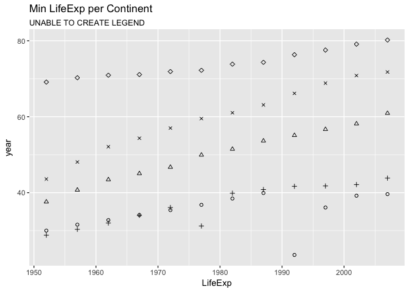

Assignment 4
================
Fariha Khan
2017-10-09

``` r
suppressPackageStartupMessages(library(tidyverse))
suppressPackageStartupMessages(library(gapminder))
suppressPackageStartupMessages(library(knitr))
suppressPackageStartupMessages(library(reshape2))
```

General data reshaping and relationship to aggregation
------------------------------------------------------

### Activity 1

#### Data reshaping cheatsheet

| reshape2 Function | tidyr Function |
|-------------------|----------------|
| `melt`            | `gather`       |
| `dcast`           | `spread`       |

### Activity 2

> Make a tibble with one row per year and columns for life expectancy for two or more countries. Use knitr::kable() to make this table look pretty in your rendered homework.

I chose six countries at random for this activity, mostly because I don't know too much about them. I first created a subset of the data without applying the spread() function, so I could later plot it more easily. I used paste() to rename the column names to add the string "lifeExp" to each country column before calling kable().

``` r
actv2_lifeExp <- as.tibble(gapminder %>% 
      filter(country %in% c("Benin","Iceland","Mozambique",
                            "Sierra Leone","Venezuela", "Zambia")) %>% 
      group_by(country) %>% 
      select(country, year, lifeExp))

actv2_lifeExp_spr <- actv2_lifeExp %>% 
      spread(country, lifeExp)
names(actv2_lifeExp_spr)[2:7] <- paste(names(actv2_lifeExp_spr)[2:7], "LifeExp", sep = " ")
kable(actv2_lifeExp_spr,
      align = "c", digits = 2, padding = 1,
      caption = "Life expectancy of a given country by year")
```

| year | Benin LifeExp | Iceland LifeExp | Mozambique LifeExp | Sierra Leone LifeExp | Venezuela LifeExp | Zambia LifeExp |
|:----:|:-------------:|:---------------:|:------------------:|:--------------------:|:-----------------:|:--------------:|
| 1952 |     38.22     |      72.49      |        31.29       |         30.33        |       55.09       |      42.04     |
| 1957 |     40.36     |      73.47      |        33.78       |         31.57        |       57.91       |      44.08     |
| 1962 |     42.62     |      73.68      |        36.16       |         32.77        |       60.77       |      46.02     |
| 1967 |     44.88     |      73.73      |        38.11       |         34.11        |       63.48       |      47.77     |
| 1972 |     47.01     |      74.46      |        40.33       |         35.40        |       65.71       |      50.11     |
| 1977 |     49.19     |      76.11      |        42.49       |         36.79        |       67.46       |      51.39     |
| 1982 |     50.90     |      76.99      |        42.80       |         38.45        |       68.56       |      51.82     |
| 1987 |     52.34     |      77.23      |        42.86       |         40.01        |       70.19       |      50.82     |
| 1992 |     53.92     |      78.77      |        44.28       |         38.33        |       71.15       |      46.10     |
| 1997 |     54.78     |      78.95      |        46.34       |         39.90        |       72.15       |      40.24     |
| 2002 |     54.41     |      80.50      |        44.03       |         41.01        |       72.77       |      39.19     |
| 2007 |     56.73     |      81.76      |        42.08       |         42.57        |       73.75       |      42.38     |

To plot this data:

``` r
ggplot(data = actv2_lifeExp, aes(x = year, y = lifeExp, color = country)) +
      geom_point(aes(shape = country)) +
      geom_smooth(size = 1, method = 'lm', se = FALSE) +
      scale_color_brewer(palette = "Set2") +
      ggtitle("Linear Model of Life Expectancy from 1952 - 2007")
```


### Activity 3

> Compute some measure of life expectancy (mean? median? min? max?) for all possible combinations of continent and year. Reshape that to have one row per year and one variable for each continent. Or the other way around: one row per continent and one variable per year.

I took the variables continent, year and life expectancy here, and took measures of the minumim, mean, and average life expectancy. The first table summarizes the first 15 rows of this data.

``` r
actv3_measures <-  gapminder %>% 
      select(continent, year, lifeExp) %>% 
      group_by(year, continent) %>% 
      summarise(Min = min(lifeExp), Avg = mean(lifeExp), Max = max(lifeExp))

kable(actv3_measures[1:15,],
              align = "c", digits = 2, padding = 1,
              caption = "Measures of life expectancy per year")
```

| year | continent |  Min  |  Avg  |  Max  |
|:----:|:---------:|:-----:|:-----:|:-----:|
| 1952 |   Africa  | 30.00 | 39.14 | 52.72 |
| 1952 |  Americas | 37.58 | 53.28 | 68.75 |
| 1952 |    Asia   | 28.80 | 46.31 | 65.39 |
| 1952 |   Europe  | 43.59 | 64.41 | 72.67 |
| 1952 |  Oceania  | 69.12 | 69.25 | 69.39 |
| 1957 |   Africa  | 31.57 | 41.27 | 58.09 |
| 1957 |  Americas | 40.70 | 55.96 | 69.96 |
| 1957 |    Asia   | 30.33 | 49.32 | 67.84 |
| 1957 |   Europe  | 48.08 | 66.70 | 73.47 |
| 1957 |  Oceania  | 70.26 | 70.30 | 70.33 |
| 1962 |   Africa  | 32.77 | 43.32 | 60.25 |
| 1962 |  Americas | 43.43 | 58.40 | 71.30 |
| 1962 |    Asia   | 32.00 | 51.56 | 69.39 |
| 1962 |   Europe  | 52.10 | 68.54 | 73.68 |
| 1962 |  Oceania  | 70.93 | 71.09 | 71.24 |

To look at the data by one row per year and one variable for each continen, I took a spread of the minimum life expectancy.

``` r
actv3_measures %>% 
      select(year, continent, Min) %>% 
      spread(continent, Min) %>% 
      kable(align = "c", digits = 2, padding = 1,
      caption = "Minimum life expectancy per year")
```

| year | Africa | Americas |  Asia | Europe | Oceania |
|:----:|:------:|:--------:|:-----:|:------:|:-------:|
| 1952 |  30.00 |   37.58  | 28.80 |  43.59 |  69.12  |
| 1957 |  31.57 |   40.70  | 30.33 |  48.08 |  70.26  |
| 1962 |  32.77 |   43.43  | 32.00 |  52.10 |  70.93  |
| 1967 |  34.11 |   45.03  | 34.02 |  54.34 |  71.10  |
| 1972 |  35.40 |   46.71  | 36.09 |  57.01 |  71.89  |
| 1977 |  36.79 |   49.92  | 31.22 |  59.51 |  72.22  |
| 1982 |  38.45 |   51.46  | 39.85 |  61.04 |  73.84  |
| 1987 |  39.91 |   53.64  | 40.82 |  63.11 |  74.32  |
| 1992 |  23.60 |   55.09  | 41.67 |  66.15 |  76.33  |
| 1997 |  36.09 |   56.67  | 41.76 |  68.83 |  77.55  |
| 2002 |  39.19 |   58.14  | 42.13 |  70.84 |  79.11  |
| 2007 |  39.61 |   60.92  | 43.83 |  71.78 |  80.20  |

Plot the minimum life expectancy

``` r
ggplot(actv3_measures, aes(x = year, y = Min, color = continent)) +
      geom_point(aes(shape = continent)) +
      geom_smooth(size = 1, method = 'lm', se = FALSE) +
      scale_color_brewer(palette = "Dark2") +
      ggtitle("Linear Model of Min Life Expectancy")
```


``` r
## Using reshaped data
actv3_measures %>% 
      select(year, continent, Min) %>% 
      spread(continent, Min) %>% 
      ggplot(aes(x = year)) +
      geom_point(aes(y = Africa), shape = 1) +
      geom_point(aes(y = Americas), shape = 2) +
      geom_point(aes(y = Asia), shape = 3) +
      geom_point(aes(y = Europe), shape = 4) +
      geom_point(aes(y = Oceania), shape = 5) +
      labs(title = "Min LifeExp per Continent", x = "LifeExp", 
           y = "year", subtitle = "UNABLE TO CREATE LEGEND")
```



Join, merge, look up
--------------------

### Activity 1

> Create a second data frame, complementary to Gapminder. Join this with (part of) Gapminder using a dplyr join function and make some observations about the process and result. Explore the different types of joins.

To create a second data frame that is complementary to Gapminder, I decided to use countries as the intersecting ID.

``` r
country_list <- unique(gapminder$country)[1:10]
currency_list <- c("AFN", "ALL", "DZD", "AOA", "ARS",
              "AUD", "EUR", "BHD", "BDT", "EUR")
country_currency <- data.frame(country = country_list,
                               Currency = currency_list)
kable(country_currency)
```

| country     | Currency |
|:------------|:---------|
| Afghanistan | AFN      |
| Albania     | ALL      |
| Algeria     | DZD      |
| Angola      | AOA      |
| Argentina   | ARS      |
| Australia   | AUD      |
| Austria     | EUR      |
| Bahrain     | BHD      |
| Bangladesh  | BDT      |
| Belgium     | EUR      |

Using left\_join()

``` r
left_join(gapminder, country_currency, by = "country")
```

    ## # A tibble: 1,704 x 7
    ##        country continent  year lifeExp      pop gdpPercap Currency
    ##         <fctr>    <fctr> <int>   <dbl>    <int>     <dbl>   <fctr>
    ##  1 Afghanistan      Asia  1952  28.801  8425333  779.4453      AFN
    ##  2 Afghanistan      Asia  1957  30.332  9240934  820.8530      AFN
    ##  3 Afghanistan      Asia  1962  31.997 10267083  853.1007      AFN
    ##  4 Afghanistan      Asia  1967  34.020 11537966  836.1971      AFN
    ##  5 Afghanistan      Asia  1972  36.088 13079460  739.9811      AFN
    ##  6 Afghanistan      Asia  1977  38.438 14880372  786.1134      AFN
    ##  7 Afghanistan      Asia  1982  39.854 12881816  978.0114      AFN
    ##  8 Afghanistan      Asia  1987  40.822 13867957  852.3959      AFN
    ##  9 Afghanistan      Asia  1992  41.674 16317921  649.3414      AFN
    ## 10 Afghanistan      Asia  1997  41.763 22227415  635.3414      AFN
    ## # ... with 1,694 more rows

Using inner\_join()

``` r
inner_join(gapminder, country_currency, by = "country") 
```

    ## # A tibble: 120 x 7
    ##        country continent  year lifeExp      pop gdpPercap Currency
    ##         <fctr>    <fctr> <int>   <dbl>    <int>     <dbl>   <fctr>
    ##  1 Afghanistan      Asia  1952  28.801  8425333  779.4453      AFN
    ##  2 Afghanistan      Asia  1957  30.332  9240934  820.8530      AFN
    ##  3 Afghanistan      Asia  1962  31.997 10267083  853.1007      AFN
    ##  4 Afghanistan      Asia  1967  34.020 11537966  836.1971      AFN
    ##  5 Afghanistan      Asia  1972  36.088 13079460  739.9811      AFN
    ##  6 Afghanistan      Asia  1977  38.438 14880372  786.1134      AFN
    ##  7 Afghanistan      Asia  1982  39.854 12881816  978.0114      AFN
    ##  8 Afghanistan      Asia  1987  40.822 13867957  852.3959      AFN
    ##  9 Afghanistan      Asia  1992  41.674 16317921  649.3414      AFN
    ## 10 Afghanistan      Asia  1997  41.763 22227415  635.3414      AFN
    ## # ... with 110 more rows

``` r
inner_join(country_currency, gapminder, by = "country") 
```

    ##         country Currency continent year lifeExp       pop  gdpPercap
    ## 1   Afghanistan      AFN      Asia 1952  28.801   8425333   779.4453
    ## 2   Afghanistan      AFN      Asia 1957  30.332   9240934   820.8530
    ## 3   Afghanistan      AFN      Asia 1962  31.997  10267083   853.1007
    ## 4   Afghanistan      AFN      Asia 1967  34.020  11537966   836.1971
    ## 5   Afghanistan      AFN      Asia 1972  36.088  13079460   739.9811
    ## 6   Afghanistan      AFN      Asia 1977  38.438  14880372   786.1134
    ## 7   Afghanistan      AFN      Asia 1982  39.854  12881816   978.0114
    ## 8   Afghanistan      AFN      Asia 1987  40.822  13867957   852.3959
    ## 9   Afghanistan      AFN      Asia 1992  41.674  16317921   649.3414
    ## 10  Afghanistan      AFN      Asia 1997  41.763  22227415   635.3414
    ## 11  Afghanistan      AFN      Asia 2002  42.129  25268405   726.7341
    ## 12  Afghanistan      AFN      Asia 2007  43.828  31889923   974.5803
    ## 13      Albania      ALL    Europe 1952  55.230   1282697  1601.0561
    ## 14      Albania      ALL    Europe 1957  59.280   1476505  1942.2842
    ## 15      Albania      ALL    Europe 1962  64.820   1728137  2312.8890
    ## 16      Albania      ALL    Europe 1967  66.220   1984060  2760.1969
    ## 17      Albania      ALL    Europe 1972  67.690   2263554  3313.4222
    ## 18      Albania      ALL    Europe 1977  68.930   2509048  3533.0039
    ## 19      Albania      ALL    Europe 1982  70.420   2780097  3630.8807
    ## 20      Albania      ALL    Europe 1987  72.000   3075321  3738.9327
    ## 21      Albania      ALL    Europe 1992  71.581   3326498  2497.4379
    ## 22      Albania      ALL    Europe 1997  72.950   3428038  3193.0546
    ## 23      Albania      ALL    Europe 2002  75.651   3508512  4604.2117
    ## 24      Albania      ALL    Europe 2007  76.423   3600523  5937.0295
    ## 25      Algeria      DZD    Africa 1952  43.077   9279525  2449.0082
    ## 26      Algeria      DZD    Africa 1957  45.685  10270856  3013.9760
    ## 27      Algeria      DZD    Africa 1962  48.303  11000948  2550.8169
    ## 28      Algeria      DZD    Africa 1967  51.407  12760499  3246.9918
    ## 29      Algeria      DZD    Africa 1972  54.518  14760787  4182.6638
    ## 30      Algeria      DZD    Africa 1977  58.014  17152804  4910.4168
    ## 31      Algeria      DZD    Africa 1982  61.368  20033753  5745.1602
    ## 32      Algeria      DZD    Africa 1987  65.799  23254956  5681.3585
    ## 33      Algeria      DZD    Africa 1992  67.744  26298373  5023.2166
    ## 34      Algeria      DZD    Africa 1997  69.152  29072015  4797.2951
    ## 35      Algeria      DZD    Africa 2002  70.994  31287142  5288.0404
    ## 36      Algeria      DZD    Africa 2007  72.301  33333216  6223.3675
    ## 37       Angola      AOA    Africa 1952  30.015   4232095  3520.6103
    ## 38       Angola      AOA    Africa 1957  31.999   4561361  3827.9405
    ## 39       Angola      AOA    Africa 1962  34.000   4826015  4269.2767
    ## 40       Angola      AOA    Africa 1967  35.985   5247469  5522.7764
    ## 41       Angola      AOA    Africa 1972  37.928   5894858  5473.2880
    ## 42       Angola      AOA    Africa 1977  39.483   6162675  3008.6474
    ## 43       Angola      AOA    Africa 1982  39.942   7016384  2756.9537
    ## 44       Angola      AOA    Africa 1987  39.906   7874230  2430.2083
    ## 45       Angola      AOA    Africa 1992  40.647   8735988  2627.8457
    ## 46       Angola      AOA    Africa 1997  40.963   9875024  2277.1409
    ## 47       Angola      AOA    Africa 2002  41.003  10866106  2773.2873
    ## 48       Angola      AOA    Africa 2007  42.731  12420476  4797.2313
    ## 49    Argentina      ARS  Americas 1952  62.485  17876956  5911.3151
    ## 50    Argentina      ARS  Americas 1957  64.399  19610538  6856.8562
    ## 51    Argentina      ARS  Americas 1962  65.142  21283783  7133.1660
    ## 52    Argentina      ARS  Americas 1967  65.634  22934225  8052.9530
    ## 53    Argentina      ARS  Americas 1972  67.065  24779799  9443.0385
    ## 54    Argentina      ARS  Americas 1977  68.481  26983828 10079.0267
    ## 55    Argentina      ARS  Americas 1982  69.942  29341374  8997.8974
    ## 56    Argentina      ARS  Americas 1987  70.774  31620918  9139.6714
    ## 57    Argentina      ARS  Americas 1992  71.868  33958947  9308.4187
    ## 58    Argentina      ARS  Americas 1997  73.275  36203463 10967.2820
    ## 59    Argentina      ARS  Americas 2002  74.340  38331121  8797.6407
    ## 60    Argentina      ARS  Americas 2007  75.320  40301927 12779.3796
    ## 61    Australia      AUD   Oceania 1952  69.120   8691212 10039.5956
    ## 62    Australia      AUD   Oceania 1957  70.330   9712569 10949.6496
    ## 63    Australia      AUD   Oceania 1962  70.930  10794968 12217.2269
    ## 64    Australia      AUD   Oceania 1967  71.100  11872264 14526.1246
    ## 65    Australia      AUD   Oceania 1972  71.930  13177000 16788.6295
    ## 66    Australia      AUD   Oceania 1977  73.490  14074100 18334.1975
    ## 67    Australia      AUD   Oceania 1982  74.740  15184200 19477.0093
    ## 68    Australia      AUD   Oceania 1987  76.320  16257249 21888.8890
    ## 69    Australia      AUD   Oceania 1992  77.560  17481977 23424.7668
    ## 70    Australia      AUD   Oceania 1997  78.830  18565243 26997.9366
    ## 71    Australia      AUD   Oceania 2002  80.370  19546792 30687.7547
    ## 72    Australia      AUD   Oceania 2007  81.235  20434176 34435.3674
    ## 73      Austria      EUR    Europe 1952  66.800   6927772  6137.0765
    ## 74      Austria      EUR    Europe 1957  67.480   6965860  8842.5980
    ## 75      Austria      EUR    Europe 1962  69.540   7129864 10750.7211
    ## 76      Austria      EUR    Europe 1967  70.140   7376998 12834.6024
    ## 77      Austria      EUR    Europe 1972  70.630   7544201 16661.6256
    ## 78      Austria      EUR    Europe 1977  72.170   7568430 19749.4223
    ## 79      Austria      EUR    Europe 1982  73.180   7574613 21597.0836
    ## 80      Austria      EUR    Europe 1987  74.940   7578903 23687.8261
    ## 81      Austria      EUR    Europe 1992  76.040   7914969 27042.0187
    ## 82      Austria      EUR    Europe 1997  77.510   8069876 29095.9207
    ## 83      Austria      EUR    Europe 2002  78.980   8148312 32417.6077
    ## 84      Austria      EUR    Europe 2007  79.829   8199783 36126.4927
    ## 85      Bahrain      BHD      Asia 1952  50.939    120447  9867.0848
    ## 86      Bahrain      BHD      Asia 1957  53.832    138655 11635.7995
    ## 87      Bahrain      BHD      Asia 1962  56.923    171863 12753.2751
    ## 88      Bahrain      BHD      Asia 1967  59.923    202182 14804.6727
    ## 89      Bahrain      BHD      Asia 1972  63.300    230800 18268.6584
    ## 90      Bahrain      BHD      Asia 1977  65.593    297410 19340.1020
    ## 91      Bahrain      BHD      Asia 1982  69.052    377967 19211.1473
    ## 92      Bahrain      BHD      Asia 1987  70.750    454612 18524.0241
    ## 93      Bahrain      BHD      Asia 1992  72.601    529491 19035.5792
    ## 94      Bahrain      BHD      Asia 1997  73.925    598561 20292.0168
    ## 95      Bahrain      BHD      Asia 2002  74.795    656397 23403.5593
    ## 96      Bahrain      BHD      Asia 2007  75.635    708573 29796.0483
    ## 97   Bangladesh      BDT      Asia 1952  37.484  46886859   684.2442
    ## 98   Bangladesh      BDT      Asia 1957  39.348  51365468   661.6375
    ## 99   Bangladesh      BDT      Asia 1962  41.216  56839289   686.3416
    ## 100  Bangladesh      BDT      Asia 1967  43.453  62821884   721.1861
    ## 101  Bangladesh      BDT      Asia 1972  45.252  70759295   630.2336
    ## 102  Bangladesh      BDT      Asia 1977  46.923  80428306   659.8772
    ## 103  Bangladesh      BDT      Asia 1982  50.009  93074406   676.9819
    ## 104  Bangladesh      BDT      Asia 1987  52.819 103764241   751.9794
    ## 105  Bangladesh      BDT      Asia 1992  56.018 113704579   837.8102
    ## 106  Bangladesh      BDT      Asia 1997  59.412 123315288   972.7700
    ## 107  Bangladesh      BDT      Asia 2002  62.013 135656790  1136.3904
    ## 108  Bangladesh      BDT      Asia 2007  64.062 150448339  1391.2538
    ## 109     Belgium      EUR    Europe 1952  68.000   8730405  8343.1051
    ## 110     Belgium      EUR    Europe 1957  69.240   8989111  9714.9606
    ## 111     Belgium      EUR    Europe 1962  70.250   9218400 10991.2068
    ## 112     Belgium      EUR    Europe 1967  70.940   9556500 13149.0412
    ## 113     Belgium      EUR    Europe 1972  71.440   9709100 16672.1436
    ## 114     Belgium      EUR    Europe 1977  72.800   9821800 19117.9745
    ## 115     Belgium      EUR    Europe 1982  73.930   9856303 20979.8459
    ## 116     Belgium      EUR    Europe 1987  75.350   9870200 22525.5631
    ## 117     Belgium      EUR    Europe 1992  76.460  10045622 25575.5707
    ## 118     Belgium      EUR    Europe 1997  77.530  10199787 27561.1966
    ## 119     Belgium      EUR    Europe 2002  78.320  10311970 30485.8838
    ## 120     Belgium      EUR    Europe 2007  79.441  10392226 33692.6051

Using anti\_join()

``` r
anti_join(gapminder, country_currency, by = "country")
```

    ## # A tibble: 1,584 x 6
    ##    country continent  year lifeExp     pop gdpPercap
    ##     <fctr>    <fctr> <int>   <dbl>   <int>     <dbl>
    ##  1   Benin    Africa  1952  38.223 1738315 1062.7522
    ##  2   Benin    Africa  1957  40.358 1925173  959.6011
    ##  3   Benin    Africa  1962  42.618 2151895  949.4991
    ##  4   Benin    Africa  1967  44.885 2427334 1035.8314
    ##  5   Benin    Africa  1972  47.014 2761407 1085.7969
    ##  6   Benin    Africa  1977  49.190 3168267 1029.1613
    ##  7   Benin    Africa  1982  50.904 3641603 1277.8976
    ##  8   Benin    Africa  1987  52.337 4243788 1225.8560
    ##  9   Benin    Africa  1992  53.919 4981671 1191.2077
    ## 10   Benin    Africa  1997  54.777 6066080 1232.9753
    ## # ... with 1,574 more rows

Using semi\_join()

``` r
semi_join(gapminder, country_currency, by = "country")
```

    ## # A tibble: 120 x 6
    ##        country continent  year lifeExp      pop gdpPercap
    ##         <fctr>    <fctr> <int>   <dbl>    <int>     <dbl>
    ##  1 Afghanistan      Asia  1952  28.801  8425333  779.4453
    ##  2 Afghanistan      Asia  1957  30.332  9240934  820.8530
    ##  3 Afghanistan      Asia  1962  31.997 10267083  853.1007
    ##  4 Afghanistan      Asia  1967  34.020 11537966  836.1971
    ##  5 Afghanistan      Asia  1972  36.088 13079460  739.9811
    ##  6 Afghanistan      Asia  1977  38.438 14880372  786.1134
    ##  7 Afghanistan      Asia  1982  39.854 12881816  978.0114
    ##  8 Afghanistan      Asia  1987  40.822 13867957  852.3959
    ##  9 Afghanistan      Asia  1992  41.674 16317921  649.3414
    ## 10 Afghanistan      Asia  1997  41.763 22227415  635.3414
    ## # ... with 110 more rows

Using full\_join()

``` r
full_join(gapminder, country_currency, by = "country")
```

    ## # A tibble: 1,704 x 7
    ##        country continent  year lifeExp      pop gdpPercap Currency
    ##         <fctr>    <fctr> <int>   <dbl>    <int>     <dbl>   <fctr>
    ##  1 Afghanistan      Asia  1952  28.801  8425333  779.4453      AFN
    ##  2 Afghanistan      Asia  1957  30.332  9240934  820.8530      AFN
    ##  3 Afghanistan      Asia  1962  31.997 10267083  853.1007      AFN
    ##  4 Afghanistan      Asia  1967  34.020 11537966  836.1971      AFN
    ##  5 Afghanistan      Asia  1972  36.088 13079460  739.9811      AFN
    ##  6 Afghanistan      Asia  1977  38.438 14880372  786.1134      AFN
    ##  7 Afghanistan      Asia  1982  39.854 12881816  978.0114      AFN
    ##  8 Afghanistan      Asia  1987  40.822 13867957  852.3959      AFN
    ##  9 Afghanistan      Asia  1992  41.674 16317921  649.3414      AFN
    ## 10 Afghanistan      Asia  1997  41.763 22227415  635.3414      AFN
    ## # ... with 1,694 more rows
