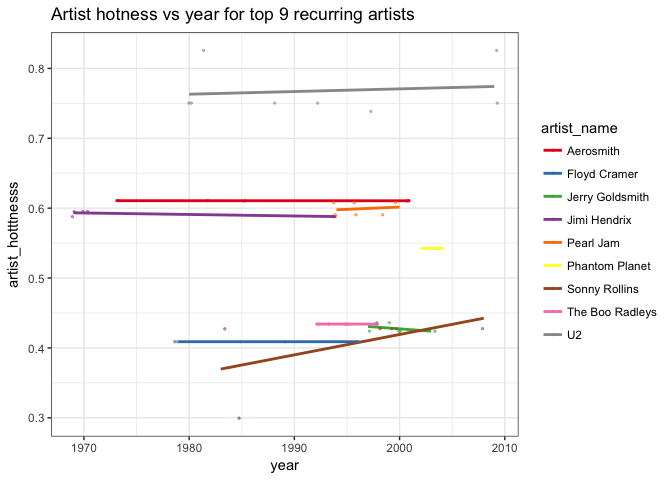

Homework 5: Factor and figure management
================
Fariha Khan
2017-10-17

``` r
suppressPackageStartupMessages(library(forcats))
suppressPackageStartupMessages(library(singer))
suppressPackageStartupMessages(library(tidyverse))
suppressPackageStartupMessages(library(knitr))
suppressPackageStartupMessages(library(reshape2))
```

Factor management
-----------------

> Using the singer dataset

``` r
data("singer_locations")
glimpse(singer_locations) 
```

    ## Observations: 10,100
    ## Variables: 14
    ## $ track_id           <chr> "TRWICRA128F42368DB", "TRXJANY128F42246FC",...
    ## $ title              <chr> "The Conversation (Cd)", "Lonely Island", "...
    ## $ song_id            <chr> "SOSURTI12A81C22FB8", "SODESQP12A6D4F98EF",...
    ## $ release            <chr> "Even If It Kills Me", "The Duke Of Earl", ...
    ## $ artist_id          <chr> "ARACDPV1187FB58DF4", "ARYBUAO1187FB3F4EB",...
    ## $ artist_name        <chr> "Motion City Soundtrack", "Gene Chandler", ...
    ## $ year               <int> 2007, 2004, 1998, 1995, 1968, 2006, 2003, 2...
    ## $ duration           <dbl> 170.4485, 106.5530, 527.5947, 695.1179, 237...
    ## $ artist_hotttnesss  <dbl> 0.6410183, 0.3937627, 0.4306226, 0.3622792,...
    ## $ artist_familiarity <dbl> 0.8230522, 0.5700167, 0.5039940, 0.4773099,...
    ## $ latitude           <dbl> NA, 41.88415, 40.71455, NA, 42.33168, 40.99...
    ## $ longitude          <dbl> NA, -87.63241, -74.00712, NA, -83.04792, -7...
    ## $ name               <chr> NA, "Gene Chandler", "Paul Horn", NA, "Doro...
    ## $ city               <chr> NA, "Chicago, IL", "New York, NY", NA, "Det...

### Define factor variables

> The function factor is used to encode a vector as a factor (the terms ‘category’ and ‘enumerated type’ are also used for factors)

*Taking a quick look at the dataset*

``` r
sapply(singer_locations, function(x) length(unique(x)))
```

    ##           track_id              title            song_id 
    ##              10100               9799              10100 
    ##            release          artist_id        artist_name 
    ##               9049               7346               7498 
    ##               year           duration  artist_hotttnesss 
    ##                 70               6742               7348 
    ## artist_familiarity           latitude          longitude 
    ##               7456                985                985 
    ##               name               city 
    ##               2913               1317

By looking at the dataframe, I decided that the columns for year, name and city would be good variables to cast as factors because they are discrete. Using the base as.factor() function coerces missing values to NA automatically. For forcats::as\_factor(), there are limitations to the values that can be used in the function.

Note: forcats::as\_factor() can't be applied to numeric objects, or NA values - producing the following errors:

-   *Error in UseMethod("as\_factor") : no applicable method for 'as\_factor' applied to an object of class "c('integer', 'numeric')"*

-   *Error: `idx` must contain one integer for each level of `f`*

To solve these errors I casted the year variable to characters, and explicitly marked NA values. I initially changed NA values in the catagorical variables to the string "NA" before converting to factor by using the following ifelse statement: `mutate(city_forcat_fct = ifelse(is.na(city), "NA", city), city = as_factor(city_forcat_fct))`. I later found found the fct\_explicit\_na() function which essentially combines the two mutate statements into one.

``` r
singer_factors <- singer_locations %>% 
      mutate(year_base_fct = as.factor(year),
             name_base_fct = as.factor(name),
             city_base_fct = as.factor(city),
             year_forcat_fct = as_factor(as.character(year)),
             name_forcat_fct = fct_explicit_na(name, na_level = "(NA)"),
             city_forcat_fct = fct_explicit_na(city, na_level = "(NA)"))

## For sanity check
glimpse(singer_factors)
```

    ## Observations: 10,100
    ## Variables: 20
    ## $ track_id           <chr> "TRWICRA128F42368DB", "TRXJANY128F42246FC",...
    ## $ title              <chr> "The Conversation (Cd)", "Lonely Island", "...
    ## $ song_id            <chr> "SOSURTI12A81C22FB8", "SODESQP12A6D4F98EF",...
    ## $ release            <chr> "Even If It Kills Me", "The Duke Of Earl", ...
    ## $ artist_id          <chr> "ARACDPV1187FB58DF4", "ARYBUAO1187FB3F4EB",...
    ## $ artist_name        <chr> "Motion City Soundtrack", "Gene Chandler", ...
    ## $ year               <int> 2007, 2004, 1998, 1995, 1968, 2006, 2003, 2...
    ## $ duration           <dbl> 170.4485, 106.5530, 527.5947, 695.1179, 237...
    ## $ artist_hotttnesss  <dbl> 0.6410183, 0.3937627, 0.4306226, 0.3622792,...
    ## $ artist_familiarity <dbl> 0.8230522, 0.5700167, 0.5039940, 0.4773099,...
    ## $ latitude           <dbl> NA, 41.88415, 40.71455, NA, 42.33168, 40.99...
    ## $ longitude          <dbl> NA, -87.63241, -74.00712, NA, -83.04792, -7...
    ## $ name               <chr> NA, "Gene Chandler", "Paul Horn", NA, "Doro...
    ## $ city               <chr> NA, "Chicago, IL", "New York, NY", NA, "Det...
    ## $ year_base_fct      <fctr> 2007, 2004, 1998, 1995, 1968, 2006, 2003, ...
    ## $ name_base_fct      <fctr> NA, Gene Chandler, Paul Horn, NA, Dorothy ...
    ## $ city_base_fct      <fctr> NA, Chicago, IL, New York, NY, NA, Detroit...
    ## $ year_forcat_fct    <fctr> 2007, 2004, 1998, 1995, 1968, 2006, 2003, ...
    ## $ name_forcat_fct    <fctr> (NA), Gene Chandler, Paul Horn, (NA), Doro...
    ## $ city_forcat_fct    <fctr> (NA), Chicago, IL, New York, NY, (NA), Det...

``` r
singer_factors %>% 
      select(year, year_base_fct, year_forcat_fct, 
             name, name_base_fct, name_forcat_fct,
             city, city_base_fct, city_forcat_fct) %>% 
      head() %>% 
      kable(align = "c")
```

| year | year\_base\_fct | year\_forcat\_fct |      name     | name\_base\_fct | name\_forcat\_fct |     city     | city\_base\_fct | city\_forcat\_fct |
|:----:|:---------------:|:-----------------:|:-------------:|:---------------:|:-----------------:|:------------:|:---------------:|:-----------------:|
| 2007 |       2007      |        2007       |       NA      |        NA       |        (NA)       |      NA      |        NA       |        (NA)       |
| 2004 |       2004      |        2004       | Gene Chandler |  Gene Chandler  |   Gene Chandler   |  Chicago, IL |   Chicago, IL   |    Chicago, IL    |
| 1998 |       1998      |        1998       |   Paul Horn   |    Paul Horn    |     Paul Horn     | New York, NY |   New York, NY  |    New York, NY   |
| 1995 |       1995      |        1995       |       NA      |        NA       |        (NA)       |      NA      |        NA       |        (NA)       |
| 1968 |       1968      |        1968       | Dorothy Ashby |  Dorothy Ashby  |   Dorothy Ashby   |  Detroit, MI |   Detroit, MI   |    Detroit, MI    |
| 2006 |       2006      |        2006       |  Barleyjuice  |   Barleyjuice   |    Barleyjuice    | Pennsylvania |   Pennsylvania  |    Pennsylvania   |

### Drop 0

Filter the singer\_locations data to remove observations associated with the uncorrectly inputed year 0. Additionally, remove unused factor levels. Provide concrete information on the data before and after removing these rows and levels; address the number of rows and the levels of the affected factors.

Looking at the singer\_factor dataframe, I'm going to look at the same 3 variable is chose to manipulate in the previous step.

``` r
with_0 <- singer_factors %>% 
      select(year_forcat_fct, name_forcat_fct, city_forcat_fct) %>% 
      summarise_all(funs(length, nlevels)) %>% 
      mutate(levels = "ALL")

dropped_0 <- singer_factors %>% 
      select(year_forcat_fct, name_forcat_fct, city_forcat_fct) %>% 
      filter(year_forcat_fct != 0) %>% 
      droplevels() %>% 
      summarise_all(funs(length, nlevels)) %>% 
      mutate(levels = "DROPPED 0")

bind_rows(with_0, dropped_0) %>% 
      rename_all(funs(gsub("_forcat_fct", "", make.names(names(with_0))))) %>% 
      column_to_rownames(var = "levels") %>% 
      kable(align = "c")
```

    ## Warning: Setting row names on a tibble is deprecated.

|           | year\_length | name\_length | city\_length | year\_nlevels | name\_nlevels | city\_nlevels |
|-----------|:------------:|:------------:|:------------:|:-------------:|:-------------:|:-------------:|
| ALL       |     10100    |     10100    |     10100    |       70      |      2913     |      1317     |
| DROPPED 0 |     10000    |     10000    |     10000    |       69      |      2879     |      1309     |

### Reorder levels based on knowledge from data

Reorder year in different ways

``` r
singer_yrdrop <- singer_locations %>% 
      mutate(year = as_factor(as.character(year)),
             artist_name = fct_explicit_na(artist_name, na_level = "(NA)"),
             title = fct_explicit_na(title, na_level = "(NA)")) %>% 
      filter(year != 0) %>% 
      droplevels()

## Unordered levels
singer_yrdrop$artist_name %>%
      levels() %>% head()
```

    ## [1] "'t Hof Van Commerce" "'Til Tuesday"        "[re:jazz]"          
    ## [4] "*Shels"              "+44"                 "10 Years"

``` r
## order by frequency
singer_yrdrop$artist_name %>% 
      fct_infreq() %>%
      levels() %>% head()
```

    ## [1] "The Boo Radleys" "U2"              "Floyd Cramer"    "Jerry Goldsmith"
    ## [5] "Jimi Hendrix"    "Pearl Jam"

``` r
## order by reverse frequency
singer_yrdrop$artist_name %>% 
      fct_infreq() %>% fct_rev() %>% 
      levels() %>% head()
```

    ## [1] "µ-ziq"                      "ZZ Top"                    
    ## [3] "Zykos"                      "Zuco 103 feat. Dani Macaco"
    ## [5] "Zounds"                     "Zombina And The Skeletones"

Reorder artist\_name based on other variables using forcats::fct\_reorder()

``` r
## order artist_name by max artist_hotttnesss
fct_reorder(singer_yrdrop$artist_name, singer_yrdrop$artist_hotttnesss,
            fun = max) %>% 
      levels() %>% head()
```

    ## [1] "A La Carte Brass & Percussion" "Abe Duque feat. Blake Baxter" 
    ## [3] "Abi Wallenstein"               "Abstürzende Brieftauben"      
    ## [5] "After Dark"                    "ÄI-TIEM"

``` r
## reverse
fct_reorder(singer_yrdrop$artist_name, singer_yrdrop$artist_hotttnesss,
            fun = max, .desc = TRUE) %>% 
      levels() %>% head()
```

    ## [1] "Daft Punk"       "Black Eyed Peas" "Coldplay"        "Rihanna"        
    ## [5] "Rihanna / Slash" "Michael Jackson"

Create plots to compare the difference between arrange() and fct\_reorder(). I'm using the 0.75 of artist\_hotttnesss as the minimum threshold for filtering artist\_name

##### plotting arrange()

Plotting the values by only using arrange does not reorder the points on the graph

``` r
## arrange artist_name by artist_hotttnesss
top25 <- singer_yrdrop %>% 
      filter(artist_hotttnesss >= 0.75) %>% 
      arrange(desc(artist_hotttnesss)) %>% 
      ggplot(aes(x = artist_hotttnesss, y = artist_name)) +
      geom_point() +
      theme(axis.text.y = element_text(angle = 15, hjust = 1))

top25
```


##### plotting fct\_reorder()

Plotting the values by only using fct\_reorder() gives an graph with ordered points

``` r
top25_reorder <- singer_yrdrop %>% 
      filter(artist_hotttnesss >= 0.75) %>% 
      ggplot(aes(x = artist_hotttnesss, y = fct_reorder(artist_name, artist_hotttnesss))) +
      geom_point() +
      theme(axis.text.y = element_text(angle = 15, hjust = 1))
top25_reorder
```


##### plotting arrange() + fct\_reorder()

Plotting the values by using arrange () AND fct\_reorder() also gives an graph with ordered points

``` r
top25_arrange_reorder <- singer_yrdrop %>% 
      filter(artist_hotttnesss >= 0.75) %>% 
      arrange(desc(artist_hotttnesss)) %>%
      ggplot(aes(x = artist_hotttnesss, y = fct_reorder(artist_name, artist_hotttnesss))) +
      geom_point() +
      theme(axis.text.x = element_text(angle = 15, hjust = 1))
top25_arrange_reorder
```


File I/O
--------

I'm going to save a subsetted dataframe that contains data filtered artist\_hotttnesss &gt;= 0.75, and contained the variables for year, artist name and title.

``` r
top25_hotness <- singer_yrdrop %>% 
      filter(artist_hotttnesss >= 0.75) %>% 
      select(year, artist_name, title, artist_hotttnesss) %>% 
      arrange(artist_name)
glimpse(top25_hotness)
```

    ## Observations: 81
    ## Variables: 4
    ## $ year              <fctr> 2004, 2006, 2003, 2003, 2003, 2009, 2005, 2...
    ## $ artist_name       <fctr> Akon, Akon / Red Café, Alicia Keys, Alicia ...
    ## $ title             <fctr> I Won't, Shake Down, You Don't Know My Name...
    ## $ artist_hotttnesss <dbl> 0.8267770, 0.8267770, 0.7786736, 0.7786736, ...

``` r
## Save file as csv
write_csv(top25_hotness, "top25_hotness.csv")
saveRDS(top25_hotness, "top25_hotness.rds")
dput(top25_hotness, "top25_hotness.txt")
```

##### Read in top25\_hotness files to see if the order of artist name remains the same

Read in using read\_csv()

``` r
csv_version <- read_csv("top25_hotness.csv")
```

    ## Parsed with column specification:
    ## cols(
    ##   year = col_integer(),
    ##   artist_name = col_character(),
    ##   title = col_character(),
    ##   artist_hotttnesss = col_double()
    ## )

``` r
glimpse(csv_version)
```

    ## Observations: 81
    ## Variables: 4
    ## $ year              <int> 2004, 2006, 2003, 2003, 2003, 2009, 2005, 20...
    ## $ artist_name       <chr> "Akon", "Akon / Red Café", "Alicia Keys", "A...
    ## $ title             <chr> "I Won't", "Shake Down", "You Don't Know My ...
    ## $ artist_hotttnesss <dbl> 0.8267770, 0.8267770, 0.7786736, 0.7786736, ...

-   Reading the file using csv does not retain the same variable types!!

-   The order of the artists didn't change however

Read in using readRDS()

``` r
rds_version <- readRDS("top25_hotness.rds")
glimpse(rds_version)
```

    ## Observations: 81
    ## Variables: 4
    ## $ year              <fctr> 2004, 2006, 2003, 2003, 2003, 2009, 2005, 2...
    ## $ artist_name       <fctr> Akon, Akon / Red Café, Alicia Keys, Alicia ...
    ## $ title             <fctr> I Won't, Shake Down, You Don't Know My Name...
    ## $ artist_hotttnesss <dbl> 0.8267770, 0.8267770, 0.7786736, 0.7786736, ...

-   Reading the file using shows no warning messages

-   Looking at the glimpe of the df shows that the data types were kept the same

-   The order of the artists didn't change

Visualization design
--------------------

I wasn't too sure about what to do. I decided to ultimately make my own plot. I'm going to use the full set of data, with certain variable as factors. I'm going to use the artist names that appear most frequently and use year as changing variable to find trends.

``` r
top_artist <- singer_yrdrop %>% 
      group_by(artist_name) %>% 
      tally() %>% 
      arrange(desc(n)) %>% 
      select(artist_name) %>% 
      head(9)
top_artists_list <- unlist(top_artist$artist_name)

plot1 <- singer_factors %>% 
      filter(artist_name %in% top_artists_list) %>% 
      ggplot(aes(x = year, y = artist_hotttnesss, color = artist_name)) +
      geom_smooth(method = lm, se = FALSE) +
      geom_jitter(size = 0.5, alpha = 0.5) +
      labs(title="Artist hotness vs year for top 9 recurring artists")+
      theme_bw()+
      scale_color_brewer(palette = "Set1") 
plot1
```


``` r
## This plot wasn't very informative so I decided to create another one
## 
plot2 <- singer_factors %>% 
      filter(artist_familiarity > mean(artist_familiarity),
             artist_hotttnesss > mean(artist_hotttnesss)) %>% 
      ggplot(aes(x = log10(artist_familiarity), y = log10(artist_hotttnesss))) +
      geom_smooth(method = lm, se = FALSE) +
      geom_jitter(size = 0.5, alpha = 0.2) +
      labs(title="Artist familiarity vs Artist hotttness")+
      theme_bw()+
      scale_color_brewer(palette = "Set2") 
plot2
```


Writing figures to file
-----------------------

``` r
ggsave("artistHotness_top9.png",
       plot = plot1, dpi = 500,
       width = 10, height = 7)

print(plot1)
```



``` r
ggsave("familliarity_vs_hotness.png",
       plot = plot2, dpi = 500,
       width = 10, height = 7)

print(plot2)
```


